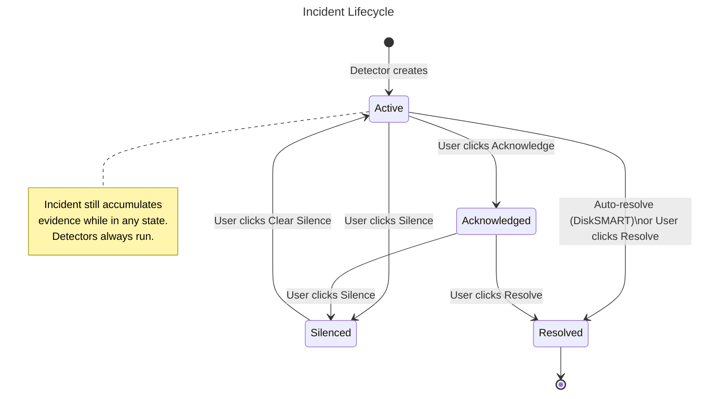
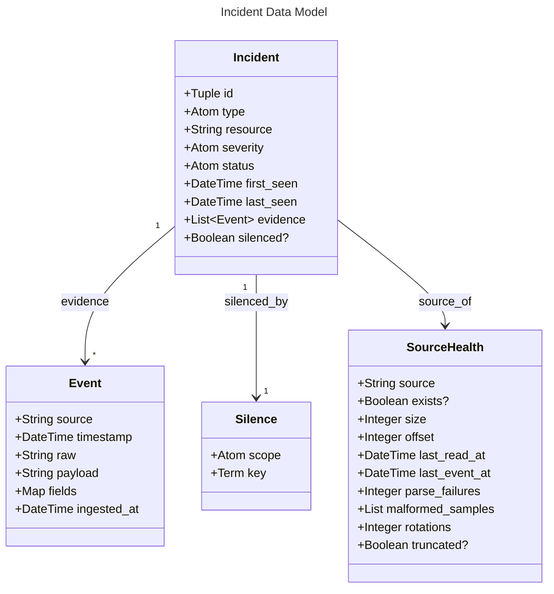
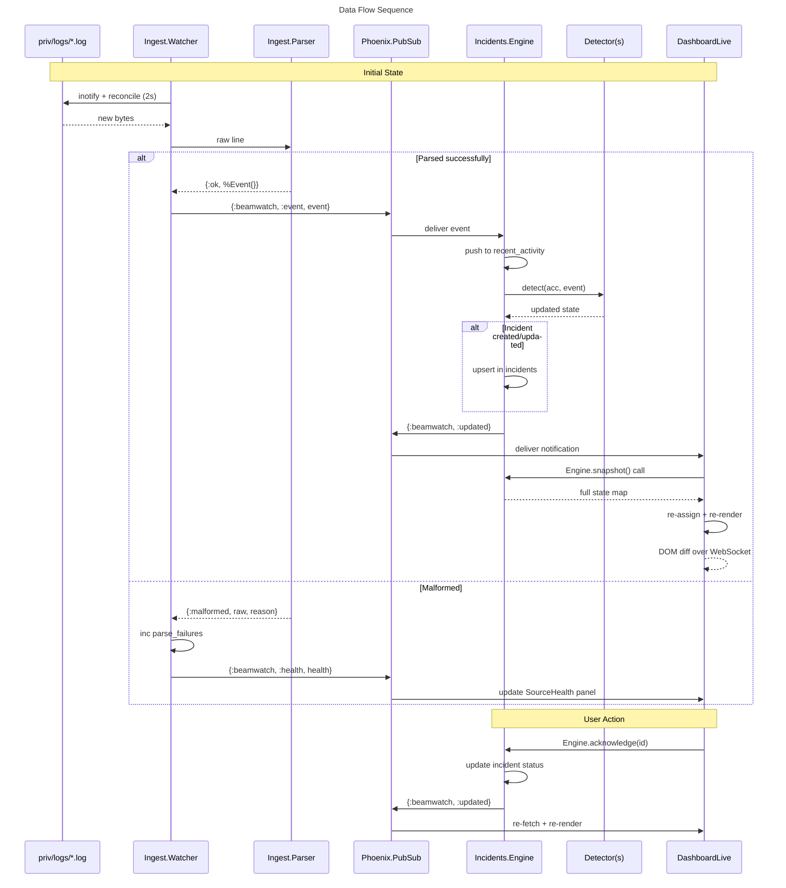

# BeamWatch Architecture

```mermaid
---
title: BeamWatch — System Architecture
---
flowchart TB
    subgraph External["External"]
        DISK[("priv/logs/\n*.log")]
        MIX["mix beamwatch.feed_logs\n(CLI / Mix Task)"]
    end

    subgraph OTP["OTP Supervision Tree"]
        SUP["BeamWatch.Supervisor"]
        PP["Phoenix.PubSub\n(BeamWatch.PubSub)"]
        WATCH["Ingest.Watcher\n(GenServer)"]
        ENG["Incidents.Engine\n(GenServer)"]
        EP["Phoenix Endpoint"]
    end

    subgraph IngestionLayer["Ingestion Layer"]
        PARSER["Ingest.Parser\nraw → %Event{}"]
        SH["SourceHealth\n(per-file tracking)"]
    end

    subgraph DetectionLayer["Detection Layer"]
        DET_BEHAVIOUR["Detector behaviour\n@callback detect(state, event)"]
        D1["ContainerRestartLoop\ncontainer=die × 4 in 60s"]
        D2["DiskSmartWarning\nSMART warning → pass (auto-resolve)"]
        D3["SharePermissionFailure\nSMB/NFS permission denied"]
        D4["VMBootFailure\nlibvirt boot failure + supporting"]
    end

    subgraph EngineState["Engine In-Memory State"]
        INCIDENTS["incidents\n%{{type,res} => %Incident{}}"]
        SILENCES["silences\n%{{scope, key} => %Silence{}}"]
        ACTIVITY["recent_activity\nlist of events (max 200)"]
        SCRATCH["detector_scratch\nper-detector buffers"]
    end

    subgraph WebLayer["Web Layer (LiveView)"]
        LV["DashboardLive\n(lib/beamwatch_web/live/)"]
        SIDEBAR["Sidebar Panel\nFilters | Quick Actions"]
        INC_LIST["Incident List\ngrouped by type"]
        ACTION_BTNS["Action Buttons\nAcknowledge | Silence | Resolve"]
        EVIDENCE["Evidence Toggle"]
        HEALTH["Source Health Table"]
        RECENT["Recent Activity"]
    end

    subgraph UserActions["User Actions"]
        UA_FILTER["phx-change=\"filter-changed\"\ncheckbox filters"]
        UA_ACK["phx-click=\"acknowledge\""]
        UA_SILENCE["phx-click=\"silence-incident\"\nphx-click=\"silence-type\""]
        UA_RESOLVE["phx-click=\"resolve\""]
        UA_CLEAR["phx-click=\"clear-silence\""]
        UA_BULK["phx-click=\"bulk-action\""]
    end

    subgraph PubSubTopics["PubSub Topics"]
        EVENTS["beamwatch:events\n{:beanwatch, :event, %Event{}}"]
        STATE["beamwatch:state\n{:beanwatch, :updated}"]
        HEALTH_TOPIC["beamwatch:health\n{:beanwatch, :health, %Health{}}"]
    end

    %% Data flow: Disk → Watcher → Parser → PubSub → Engine → LiveView
    DISK -->|"inotify + reconcile (2s)"| WATCH
    MIX -->|"writes log lines"| DISK
    WATCH -->|"raw bytes"| PARSER
    PARSER -->|"%Event{} or {:malformed}"| SH
    PARSER -->|"%Event{}"| EVENTS
    EVENTS -->|"subscribed"| ENG
    WATCH -->|"per-file health"| HEALTH_TOPIC

    %% Engine processing
    ENG -->|"push to ring buffer"| ACTIVITY
    ENG -->|"iterate"| DET_BEHAVIOUR
    DET_BEHAVIOUR --> D1
    DET_BEHAVIOUR --> D2
    DET_BEHAVIOUR --> D3
    DET_BEHAVIOUR --> D4
    D1 -->|"create/update"| INCIDENTS
    D2 -->|"create/update/resolve"| INCIDENTS
    D3 -->|"create/update"| INCIDENTS
    D4 -->|"create/update"| INCIDENTS
    D1 -->|"buffer die events"| SCRATCH
    D2 -->|"track warning count"| SCRATCH
    D4 -->|"buffer VM events"| SCRATCH
    ENG -->|"apply/clear"| SILENCES
    SILENCES -->|"sets silenced? flag"| INCIDENTS
    ENG -->|"broadcast"| STATE

    %% LiveView
    STATE -->|"subscribed"| LV
    HEALTH_TOPIC -->|"subscribed"| LV
    LV -->|"Engine.snapshot()"| ENG
    LV -->|"reads"| INCIDENTS
    LV -->|"reads"| SILENCES
    LV -->|"reads"| ACTIVITY

    %% Rendering
    LV --> SIDEBAR
    LV --> INC_LIST
    LV --> ACTION_BTNS
    LV --> EVIDENCE
    LV --> HEALTH
    LV --> RECENT

    %% User actions → Engine
    UA_FILTER -->|"assign(socket, filters)"| LV
    UA_ACK -->|"Engine.acknowledge()"| ENG
    UA_SILENCE -->|"Engine.silence()"| ENG
    UA_RESOLVE -->|"Engine.resolve()"| ENG
    UA_CLEAR -->|"Engine.clear_silence()"| ENG
    UA_BULK -->|"iterate filtered → Engine calls"| ENG

    %% Styles
    classDef external fill:#f5f5f5,stroke:#999,stroke-dasharray:5 5
    classDef otp fill:#e1f5fe,stroke:#0288d1
    classDef data fill:#fff3e0,stroke:#f57c00
    classDef detection fill:#e8f5e9,stroke:#388e3c
    classDef pubsub fill:#f3e5f5,stroke:#7b1fa2
    classDef web fill:#e0f2f1,stroke:#00796b
    classDef user fill:#fce4ec,stroke:#c62828

    class DISK,MIX external
    class SUP,PP,WATCH,ENG,EP otp
    class PARSER,SH,INCIDENTS,SILENCES,ACTIVITY,SCRATCH data
    class D1,D2,D3,D4,DET_BEHAVIOUR detection
    class EVENTS,STATE,HEALTH_TOPIC pubsub
    class LV,SIDEBAR,INC_LIST,ACTION_BTNS,EVIDENCE,HEALTH,RECENT web
    class UA_FILTER,UA_ACK,UA_SILENCE,UA_RESOLVE,UA_CLEAR,UA_BULK user
```






